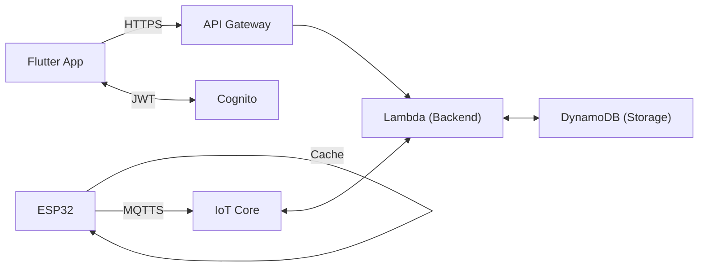

```mermaid
flowchart LR
    ESP["ESP32"]
    APP["Flutter App"]
    IOT["IoT Core"]
    LAMBDA["Lambda (Backend)"]
    DB["DynamoDB (Storage)"]
    API["API Gateway"]
    AUTH["Cognito"]

    ESP -->|Cache| ESP
    ESP -->|MQTTS| IOT
    IOT <--> LAMBDA
    LAMBDA <--> DB
    APP -->|HTTPS| API
    API --> LAMBDA
    APP <-->|JWT| AUTH
```
